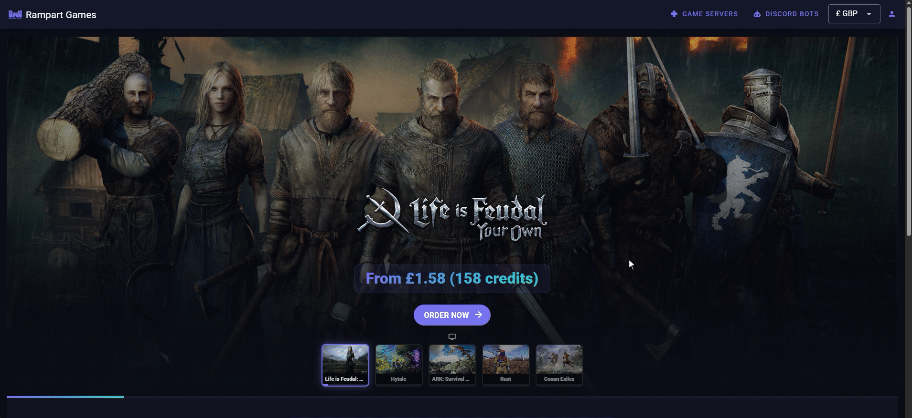

# Adding credits

To add credits to a community wallet:

1. Click "My Account".
2. Select the "Communities" tab on the left.
3. Select the correct community from the list of those available to see the community admin page.
4. You can copy the "Contribution Link" and share it with your gaming group, so they can add credits to the wallet (they do not need to be members or have a Rampart account).
5. You can also transfer credits directly from your personal wallet by clicking "Contribute".\
   You will need to specify the amount and confirm acceptance of the Terms and Conditions.\
   Minimum transfer is 100 credits.
6. You can view the wallet balance at the top of the page, and a list of contributions using the "Transactions" tab.

<figure><figcaption></figcaption></figure>
