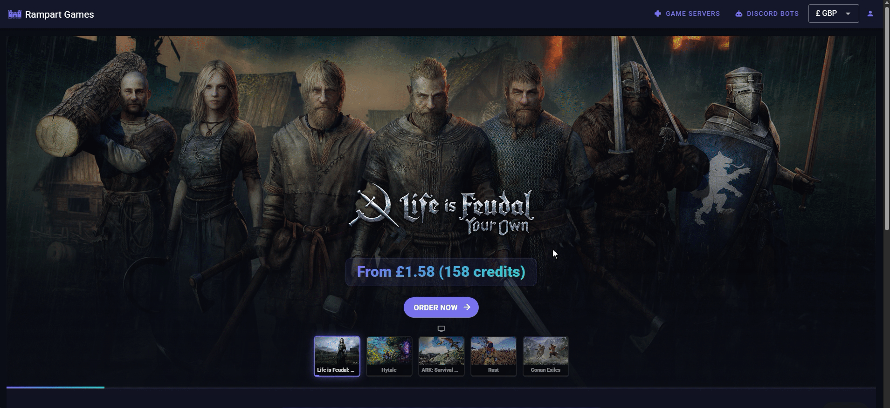

# Creating a Community

To create a Community:

1. Click "My Account"
2. Select the "Communities" tab on the left
3. Click "Create Community"
4. Select the correct community from the list of those available to see the community admin page

<figure><figcaption></figcaption></figure>
