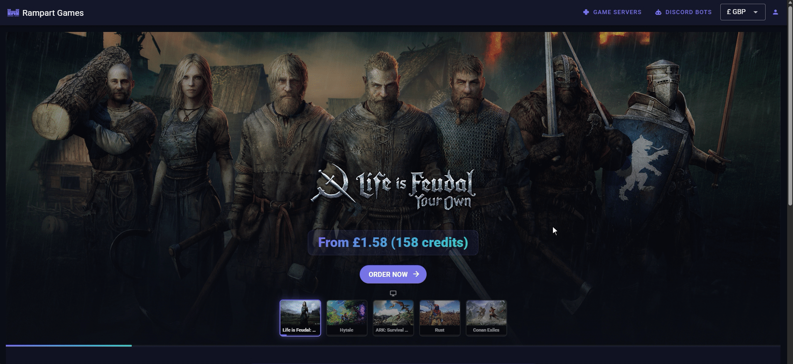

# Linking an existing server

To spend community wallet credits on an existing subscription:

1. Click "My Account"
2. Select the "Subscriptions" tab on the left
3. Identify the relevant server and click "Change Payment Method"
4. Select "Pay With Credits", choose the relevant community wallet from the list, and click "Save"
5. The community wallet is now linked to the server, and credits from the wallet will be used to maintain the subscription

<figure><figcaption></figcaption></figure>
