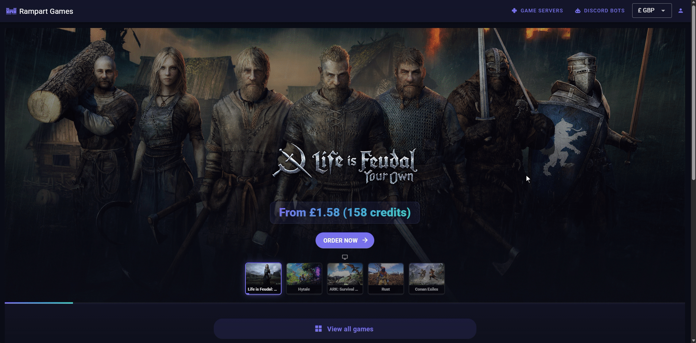

# Spending credits

To spend community wallet credits on a new subscription:

1. Choose a game.
2. Choose your configuration.
3. Select "Pay With Credits" to see a list of available wallets.
4. Choose the correct community wallet.
5. If you have a registered payment method you can choose whether or not to default to it if wallet credits run out.
6. Confirm acceptance of the Terms and Conditions and finalise the payment.

<figure><figcaption></figcaption></figure>
