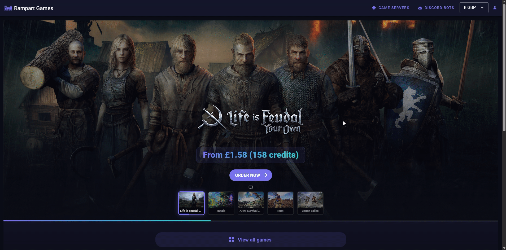

# Viewing & removing server links

To view a list of linked servers:

1. Click "My Account"
2. Select the "Communities" tab on the left
3. Select the correct community from the list of those available to see the community admin page
4. Click the "Linked Servers" tab to see a list of all servers currently linked to the community wallet
5. To remove a server's wallet link, click "Unlink", and confirm in the popup\
   The server owner will need to add a new payment method before the next renewal date

<figure><figcaption></figcaption></figure>
