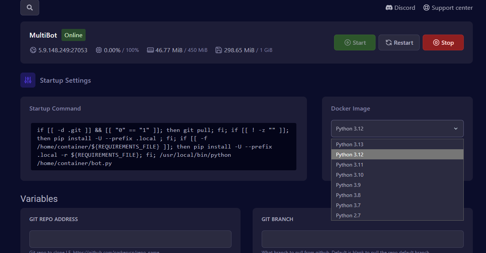
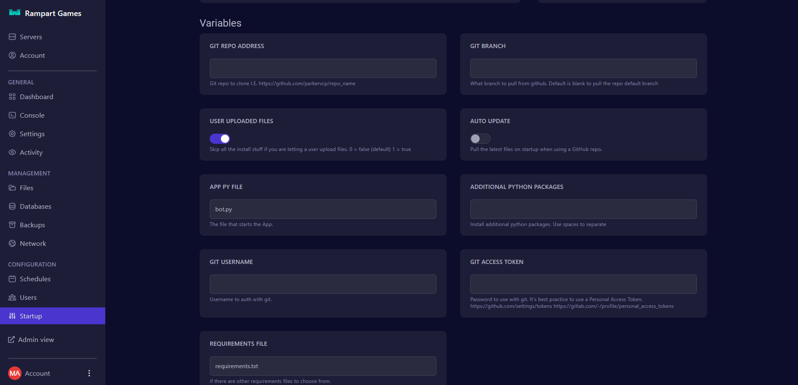

# Discord Bot Hosting

Would I need to do any port forwarding?

Since we host the server on your behalf, there is no port forwarding necessary, we've taken care of that for you

How long does it take to set up my server?

Normally it should be up within minutes if not seconds.\
Look for an email that tells you that the server is installed, at that point you have been issued a server.

How to configure my bot hosting?

To Configure your bot hosting please edit the variables in the startup area of the panel to make changes\

*   Choose the correct Docker image for your bot

    <figure><figcaption></figcaption></figure>
*   Any settings here will override your settings at each startup\

    <figure><figcaption></figcaption></figure>

\
Additionally ensure you edit the configuration files if any exist for the bot you have installed to the service

