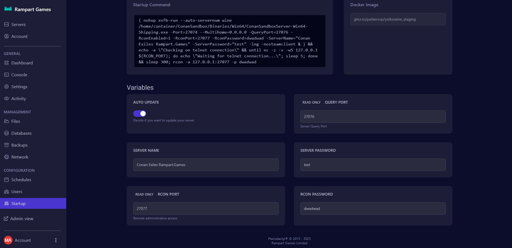
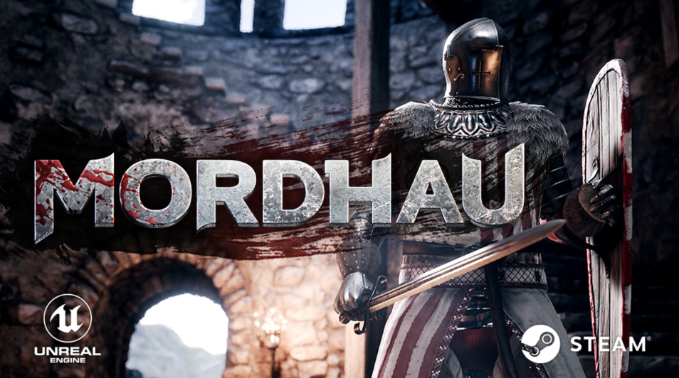

# Game Server

Would I need to do any port forwarding?

Since we host the server on your behalf, there is no port forwarding necessary, we've taken care of that for you

How long does it take to set up my server?

Normally it should be up within minutes if not seconds.\
Look for an email that tells you that the server is installed, at that point you have been issued a server.

How to i configure my game server?

To Configure your game server please edit the variables in the startup area of your game server panel to make changes

*   Any settings here will override your files at each startup\

    <figure><figcaption></figcaption></figure>

How to Create/Restore a backup?

## To Create a backup&#x20;

1\) Click Backups on the left menu\
\
2\) Click "Create Backup" once the page displays this.

* It is advised to stop the server Prior to doing this.

<figure><figcaption></figcaption></figure>

Once Completed feel free to use the service as normal.

## Restoring a Backup

1\) Click Backups

2\) Click the 3 dots next to the backup and click "Restore" from the drop down menu

<figure><figcaption></figcaption></figure>

Once Completed feel free to use the service as normal.

