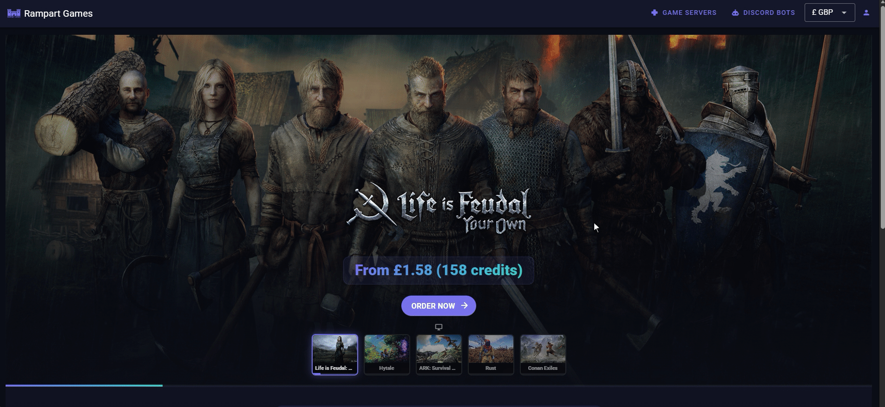

# Wallets & credits

When placing an order, you have the option to pay with credits.\
To do so, you will need to have sufficient credits in your personal "wallet".\
You can also use the subscriptions tab in My Account to change payment method between currency and credits.

To add credits to your wallet:

1. Click "My Account"
2. Select the "Wallet" tab on the left
3. Click "Top Up"
4. Choose the number of credits to purchase
5. Choose a payment method and confirm payment

<figure><figcaption></figcaption></figure>

