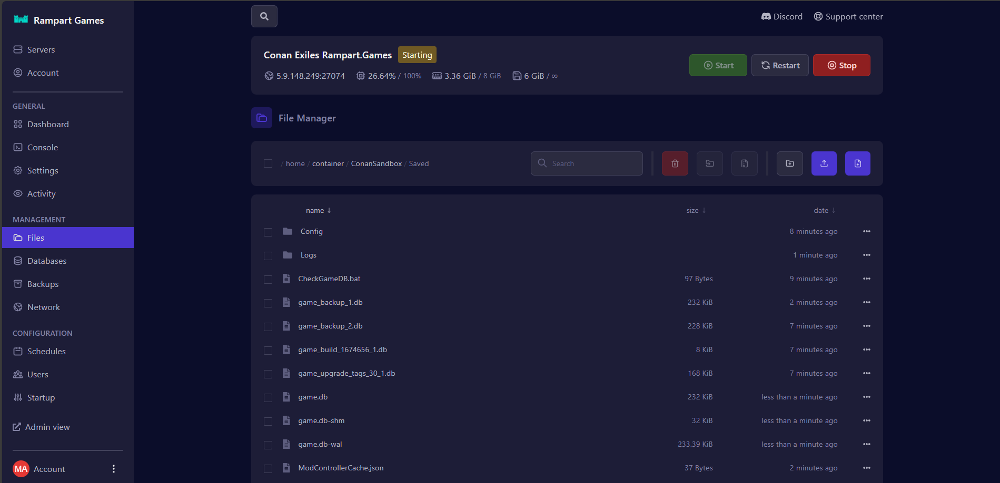
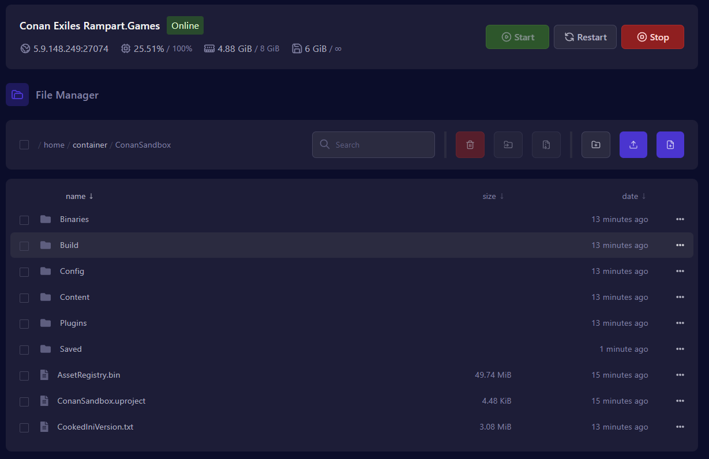
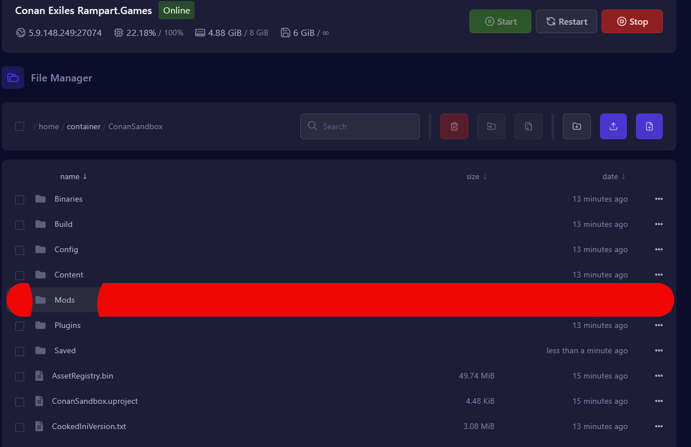

# Conan modding help



\
\



Go to "Files" under the header management within the game panel,

<figure><figcaption></figcaption></figure>




Enter folder "ConanSandbox",

<figure><figcaption></figcaption></figure>



Create a folder named "Mods",

<figure><figcaption></figcaption></figure>



Upload your mod files (.pak files) and the "modlist.txt" file into the new mods folder,

<figure><figcaption></figcaption></figure>

\
[Quick Tip: Click subscribe to mods on your steam and find the pak files in the location\
`\SteamLibrary\steamapps\workshop\content\440900`\
(You may need to launch the game after subscribing for the folder to appear)](#user-content-fn-1)[^1]



Finally, restart your server to make the server use the mods.,




### Example Modlist file

Example modlist.txt file (file names ARE CASE Sensitive)
\
\*Mod1.pak
\
\*Mod2.pak
\
\*Mod3.pak
\
\*Mod4.pak



[^1]: 
