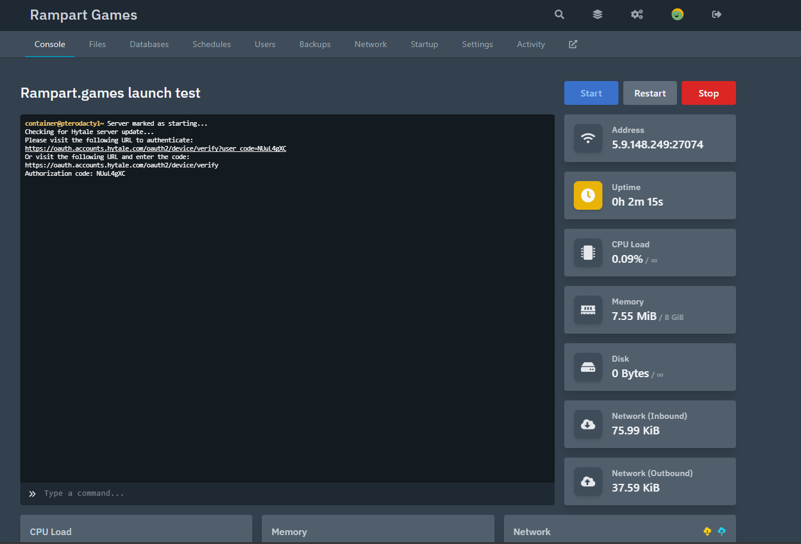
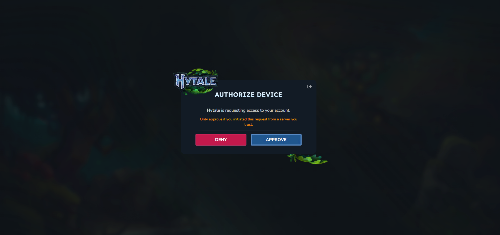
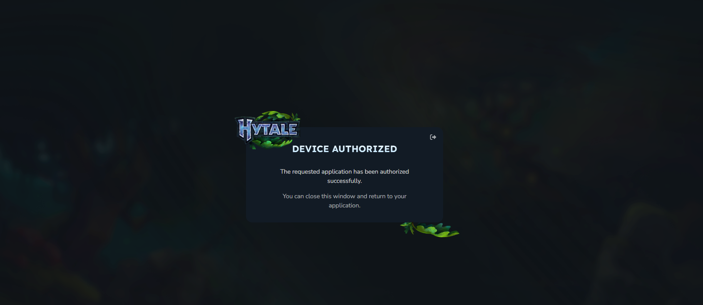
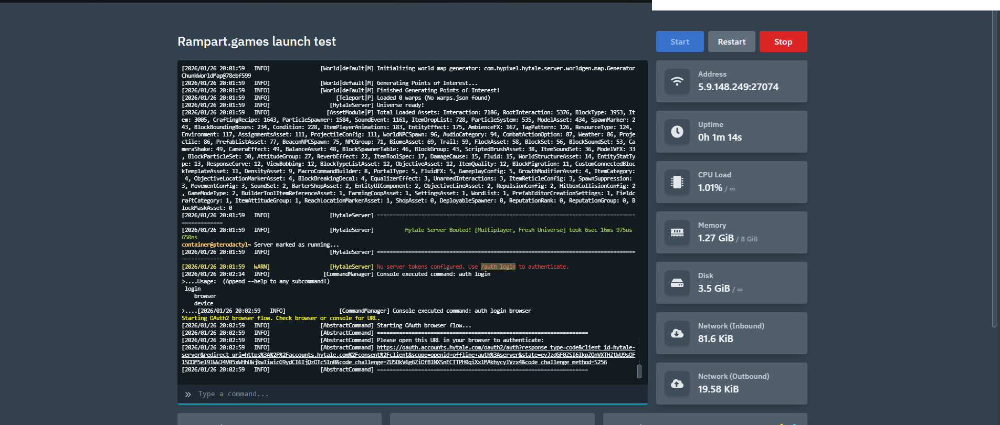
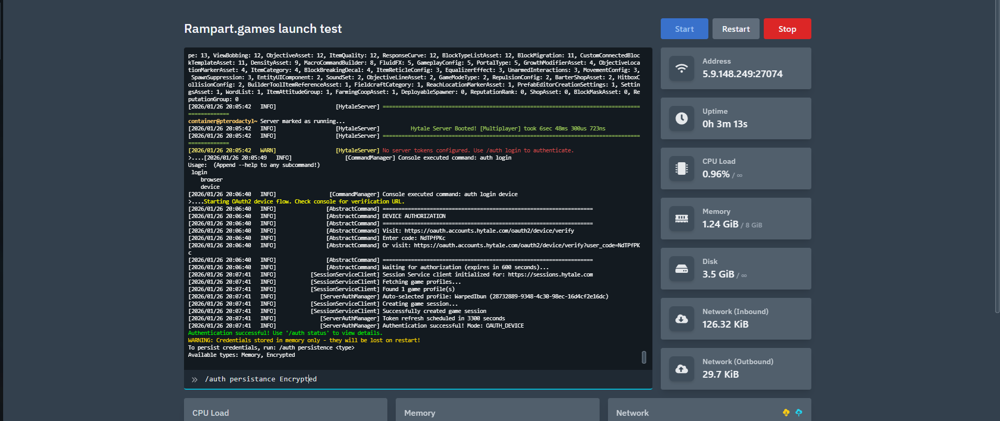
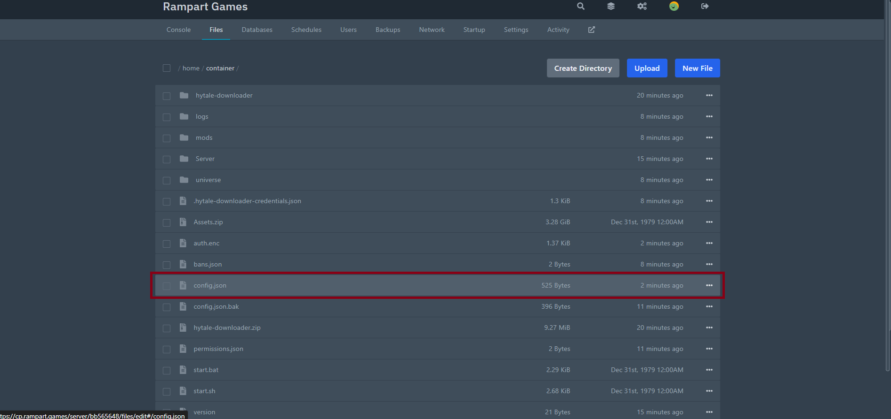
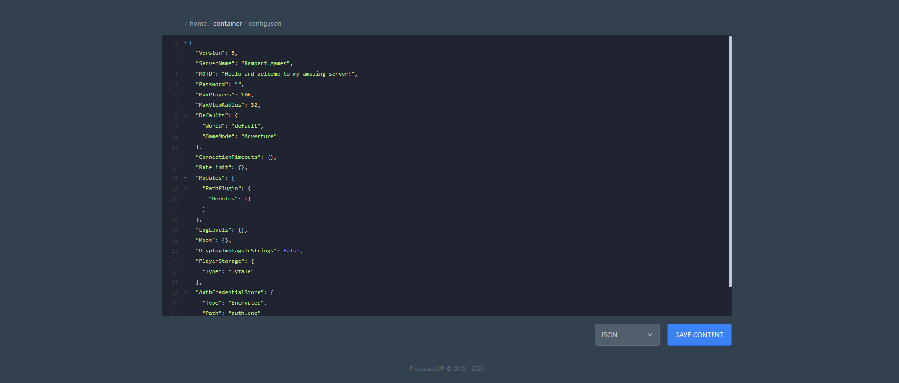
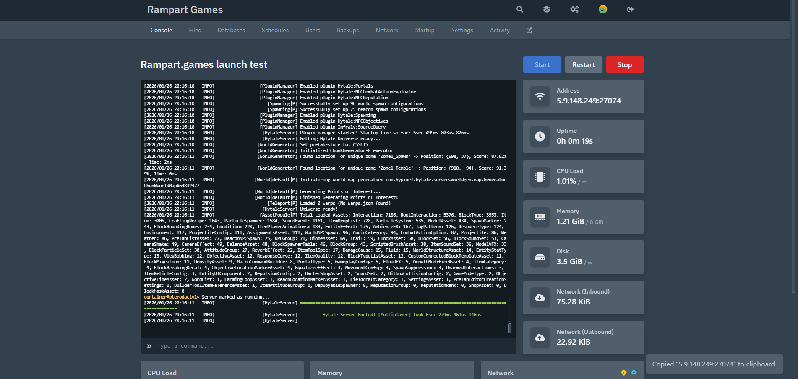

# First Start up!

<figure><figcaption></figcaption></figure>

Congratulations on the purchase of your brand new game server! \
\
First start up can be somewhat finicky so lets get into how it is done.<br>



### Turn on your server

Welcome to your first start up, lets get into how to set it up.<br>

* Click on the link in the console it will be shown as below.\
  Use the top of the two links.

```
https://oauth.accounts.hytale.com/oauth1/device/verify?user_code=YOURCODE
```

<figure><figcaption></figcaption></figure>



### Authorise Device

To begin with ensure you already own the game and have the launcher and game installed.

1.  Click Approve to start your process.<br>

    <figure><figcaption></figcaption></figure>
2. Once this is done, you should see the page change to Device Authorised as pictured below.

<figure><figcaption></figcaption></figure>



### Registering the Server

1.  It will now begin to download the game server files and start the installation process.\
    You must again click the link in the console (pictured below) to start the registration process.<br>

    <figure><figcaption></figcaption></figure>
2. As Pictured below you must type when asked in console the following

```
/auth login device
```

<figure><figcaption></figcaption></figure>

*   It will now show in browser you are again authorised<br>

    <figure><figcaption></figcaption></figure>



### Ensuring you do not have to do this again!

Now that you have Authorised your device fully it is time to ensure it remains so.

At this point, as pictured below, you need to type/copy the following, to ensure your token stays valid.

```
/auth persistence Encrypted
```

<figure><figcaption></figcaption></figure>

You will then see that authentication has been successful and that the credentials have been stored in memory.<br>



Edit Configuration file

It is now time to edit your configuration file. This is located in the servers root directory and is the config.json file as pictured.

<figure><figcaption></figcaption></figure>



### Configuration amendments

Here you are able to change the following:

1. Server name
2. Message of the day (MOTD)
3. Server Password
4. Max Players (No Limitation at [Rampart.Games](https://rampart.games), you are only limited by the game itself)
5. World
6. GameMode (Default Adventure)
7. Much more as pictured below

<figure><figcaption></figcaption></figure>



### Restart the server

Restart the server to implement your config changes.  At this point you should not need to reregister the server again, as you have completed Step 4.

<figure><figcaption></figcaption></figure>



### Enjoy your new game server!





