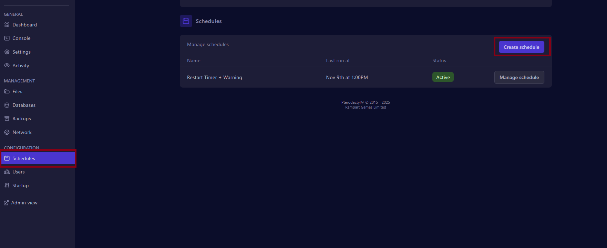
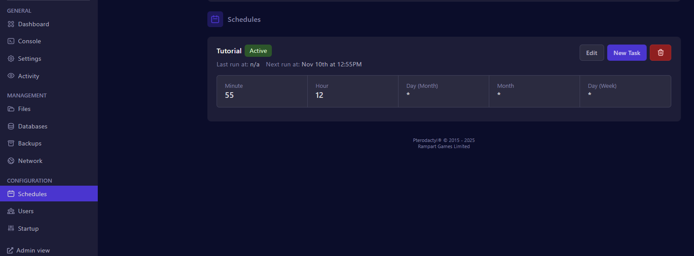
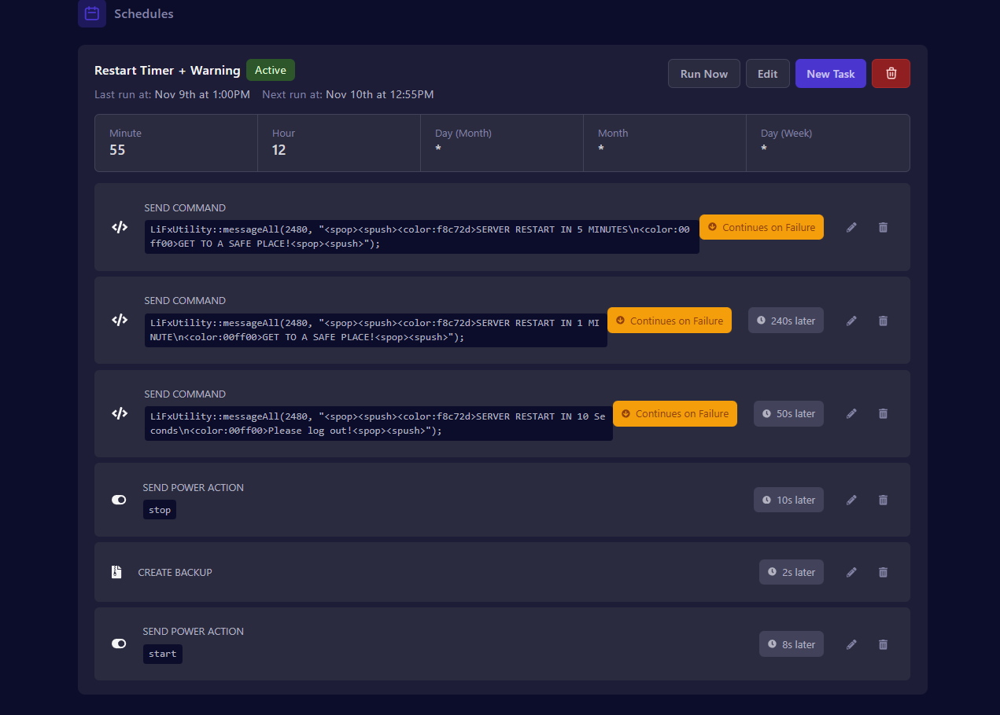

# Restart Timer



Set a task 5 mins prior to restart

1. Select Schedules in the Configuration section (left menu)
2. Click Create Schedule

<figure><figcaption></figcaption></figure>



### Setting up tasks

Once the schedule is created you will see a schedule with no tasks

<figure><figcaption></figcaption></figure>

1. Click "New Task"
2. Use the Action "Send Command"
3.  For Payload use the below for a 5 min warning timer as pictured below\
    \- It will trigger the first warning message to be sent immediatly as the restart should be timed for 5 mins after the Power action this is perfect for the requirement.

    <figure><figcaption></figcaption></figure>

    ```
    LiFxUtility::messageAll(2480, "<spop><spush><color:f8c72d>SERVER RESTART IN 5 MINUTES\n<color:00ff00>GET TO A SAFE PLACE!<spop><spush>");

    ```



### Add more tasks if required

1. More restart warnings (if required, ensure to add delay timers)
2. Send power action\
   \- Ensure that you are adding delays for each tasks \
   \- A complete version is pictured below

<figure><figcaption></figcaption></figure>



