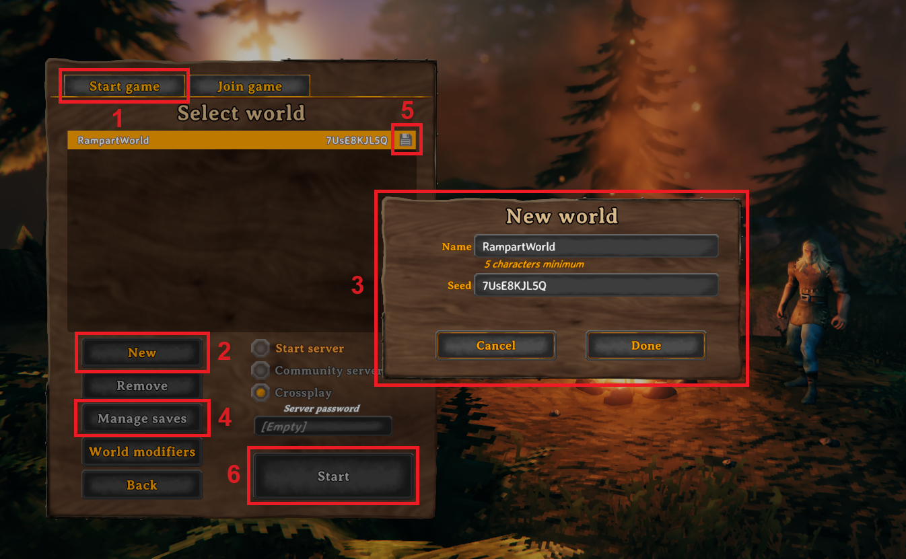
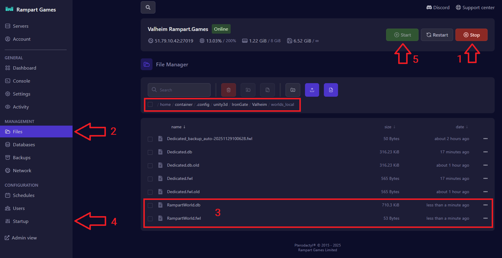

# Importing a world seed

When a Valheim game is created, a pseudo-random world map is generated, along with a short code that corresponds to that map. This code is referred to as a "seed".

It is possible to generate a world with a specific seed, and import it to your server, allowing you to play on a specifically chosen map.

The simplest way to find a good world seed is to search online, in Valheim community groups and forums. They are full of "best of" seed lists, for worlds with good rivers, draugr villages, island hopping, nearby traders and bosses, and more.

The seed should look something like this: 7UsE8KJL5Q

Once you have chosen a seed, you will need to generate a game world in single player, then import it to your dedicated server.

#### Generating a world with your chosen seed

<figure><figcaption></figcaption></figure>

Start Valheim (a local single player game, not your dedicated server).

With the game now open, click "Start Game", then select a character and click "Start".

1. In the next screen, make sure that the "Start Game" tab is selected.
2. Click "New".
3. In the pop-up window, enter a name for your world, as well as your chosen seed, and click "Done".
4. Click "Manage saves", and in the pop-up window, select your world and click "Move to local".
5. You should see a 3.5" floppy disk, _not a cloud_, next to your world name and seed number.
6. Select your world and click "Start".

You should now shut down your Valheim game. The newly generated world will be saved in your local game files.

#### Transferring your new world to your dedicated server

Using the file explorer on your local computer (not your dedicated server), go to C:\Users\\\*YourUserName\*\AppData\LocalLow\​IronGate\Valheim\worlds\_local

There might be several files listed here, but you only need two. You're looking for a .fwl and a .db file, with the world name you chose above. In this example, we're looking for RampartWorld.fwl and RampartWorld.db

Now, using your Rampart account, go to your dedicated server panel:

<figure><figcaption></figcaption></figure>

1. Stop the server.
2. Click the "Files" tab, and follow the path ".config/unity3d/IronGate/Valheim/worlds\_local".
3. Drag and drop the RampartWorld.fwl and RampartWorld.db files from your local computer into the worlds\_local folder of your dedicated server.
4. Click on the "Startup" tab and enter your world name into the "World Name" box. In this example, the world name is "RampartWorld" (the same name as the .fwl file you copied).
5. Start the server.

Your server should now be loading your new world seed.
